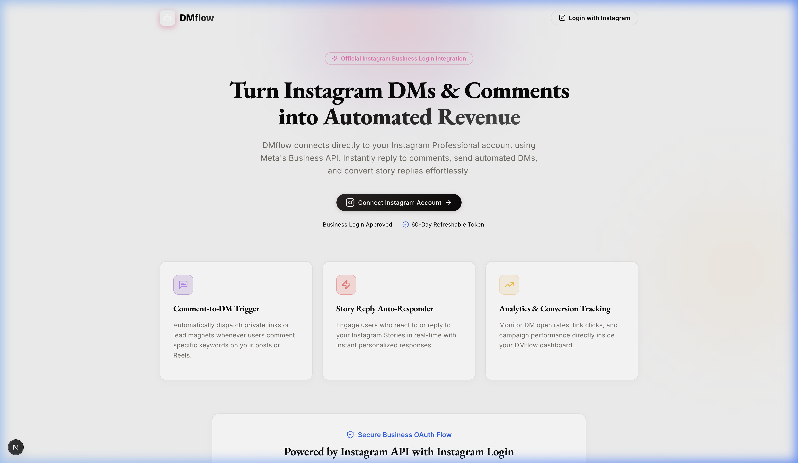
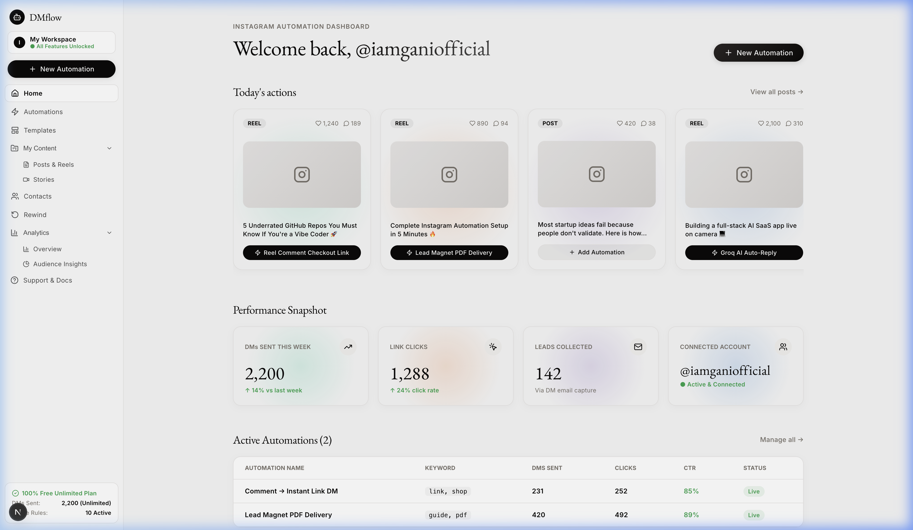
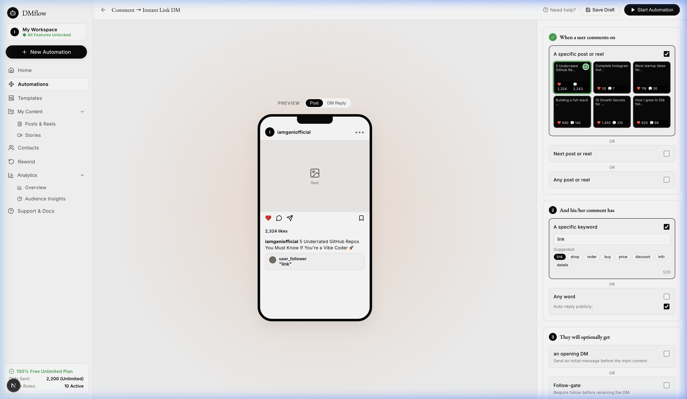
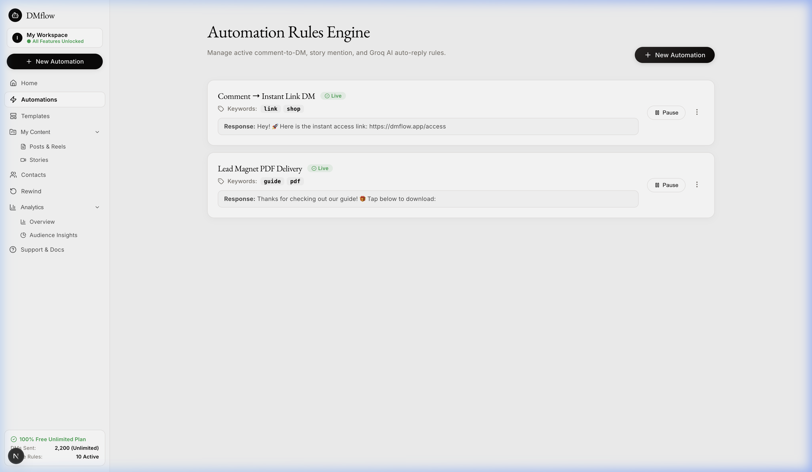

# DMflow 🚀
> Next-Generation Instagram Professional Automation & AI Auto-Reply Platform (100% Free & Unlimited)

DMflow is a full-featured Instagram Direct Message, comment-to-DM, story mention, and AI-powered auto-reply SaaS built with **Next.js 15**, **TypeScript**, **Supabase**, and **Groq Llama 3.1 AI**.

Inspired by ElevenLabs' quietly editorial print magazine design system (off-white canvas, warm near-black ink, soft atmospheric pastel gradient orbs), DMflow combines visual elegance with high-performance automation.

---

## 📸 Screenshots

### 1. Landing Page & Meta Business Connection


### 2. Analytics & Performance Dashboard


### 3. Centerpiece Automation Builder (Live Mobile Preview)


### 4. Automation Rules Engine & Status Management


---

## ✨ Features

- **⚡ Centerpiece Automation Builder**:
  - **Step 1**: Target specific Instagram posts/reels or trigger on any post.
  - **Step 2**: Match specific comment keywords (`link`, `shop`, `discount`, etc.) or trigger on any word.
  - **Step 3**: Optional actions — Opening DM (with custom button text), Follow-gate requirement, and Email Capture.
  - **Step 4**: Custom DM response with character limits, CTA buttons, and interactive modal link editor.
  - **Live iPhone Frame Mockup**: Real-time rendering of post comments and direct message thread bubbles.

- **🤖 Groq Llama 3.1 AI Auto-Reply Engine**:
  - Contextual AI auto-replies for unmatched comments or DMs using custom brand voice context and Groq's fast AI model.
  - Automatic fallback guardrails for response length and API timeouts.

- **📊 Comprehensive Analytics & Insights**:
  - Track DMs sent, CTA link clicks, CTR%, and total leads collected.
  - Interactive charts, top commenters leaderboard, and audience segment insights.

- **📁 Contacts Management**:
  - Lead contact directory storing usernames, captured emails, and DM interaction stats.
  - One-click CSV export functionality.

- **💎 100% Free & Unlimited**:
  - Zero paywalls, zero locked features, and no hard DM limits.

---

## 🛠️ Tech Stack

- **Framework**: Next.js 15 (App Router, Server Actions)
- **Language**: TypeScript
- **Styling**: Modern CSS variables & ElevenLabs Quietly Editorial Design System
- **Database**: Supabase (PostgreSQL, Row Level Security)
- **AI**: Groq SDK (`llama-3.1-8b-instant`)
- **Icons**: Lucide React

---

## Required APIs & Setup

DMflow needs the following external services to run. All of them have free tiers that are enough for personal use.

> **⚠️ You must create your own accounts and API keys.** This repository does not include any working credentials. Each person who runs DMflow needs their own Meta Developer App, their own Supabase project, and their own Groq API key. You cannot reuse anyone else's keys — they are tied to your own Instagram Business account and database.

### 1. Supabase (Database + Auth) — Free
- What it's for: stores users, automations, conversations, messages, contacts, rewind jobs
- Get it: supabase.com → New Project → Settings → API
- You need: Project URL, anon public key, service_role key (keep this one secret)

### 2. Meta Developer App — Instagram Business Login — Free
- What it's for: connecting the user's Instagram account, receiving webhook events (comments/DMs/story mentions), sending automated replies
- Get it: developers.facebook.com → Create App → add the "Instagram" product → "Instagram API with Instagram Login" (Business Login) — NOT Facebook Login, NOT Instagram Basic Display
- You need: Instagram App ID, Instagram App Secret, a redirect URI matching your deployed domain (e.g. https://yourapp.com/api/auth/callback), and a Webhook Verify Token (any string you choose yourself)
- Requires: the connected Instagram account must be a Business or Creator account, not personal
- Note: webhooks need a public URL — for local dev, use a tunnel tool like ngrok or Cloudflare Tunnel to expose localhost, then use that tunnel URL as your webhook URL in the Meta app settings

### 3. Groq API (AI Auto-Reply) — Free
- What it's for: powers the AI catch-all reply feature (llama-3.1-8b-instant model)
- Get it: console.groq.com → API Keys → Create Key
- Optional: the app works without this, AI replies just won't fire and fall back to a default response

### Environment Variables Summary
Copy `.env.example` to `.env.local` and fill in:
- `NEXT_PUBLIC_SUPABASE_URL`, `NEXT_PUBLIC_SUPABASE_ANON_KEY`, `SUPABASE_SERVICE_ROLE_KEY`
- `NEXT_PUBLIC_INSTAGRAM_APP_ID`, `INSTAGRAM_APP_ID`, `INSTAGRAM_APP_SECRET`, `NEXT_PUBLIC_INSTAGRAM_REDIRECT_URI`, `INSTAGRAM_WEBHOOK_VERIFY_TOKEN`
- `GROQ_API_KEY`

---

## 🚀 Getting Started

### Prerequisites

- Node.js 18+ and `npm`

### Installation

1. **Clone the repository**:
   ```bash
   git clone git@github.com:Ganeshp000/DMflow.git
   cd DMflow
   ```

2. **Install dependencies**:
   ```bash
   npm install
   ```

3. **Configure Environment Variables**:
   Create a `.env.local` file in the root directory:
   ```env
   # Supabase Credentials
   NEXT_PUBLIC_SUPABASE_URL=https://your-project.supabase.co
   NEXT_PUBLIC_SUPABASE_ANON_KEY=your-anon-key
   SUPABASE_SERVICE_ROLE_KEY=your-service-role-key

   # Instagram Meta Business Login API
   NEXT_PUBLIC_INSTAGRAM_APP_ID=1234567890
   INSTAGRAM_APP_ID=1234567890
   INSTAGRAM_APP_SECRET=your_app_secret
   NEXT_PUBLIC_INSTAGRAM_REDIRECT_URI=http://localhost:3000/api/auth/callback
   INSTAGRAM_WEBHOOK_VERIFY_TOKEN=dmflow_secret_token_123

   # Groq AI API Key
   GROQ_API_KEY=gsk_your_groq_api_key
   ```

4. **Run Development Server**:
   ```bash
   npm run dev
   ```

5. Open [http://localhost:3000](http://localhost:3000) in your browser.

---

## 🌐 Local Development with Webhooks

Instagram webhooks require a publicly accessible HTTPS URL even during local testing. To test real Instagram comment, DM, and story mention events locally:
1. Expose your local development server (`http://localhost:3000`) using a tunneling service like **ngrok** (`ngrok http 3000`) or **Cloudflare Tunnel** (`cloudflared tunnel --url http://localhost:3000`).
2. Use the resulting HTTPS tunnel URL as your Webhook Callback URL in Meta Developer Dashboard (e.g. `https://your-tunnel.ngrok-free.app/api/webhook/instagram`).
3. Set your custom verification token matching `INSTAGRAM_WEBHOOK_VERIFY_TOKEN` in `.env.local`.

---

## ⚖️ Responsible Use

DMflow automates Instagram DM and comment replies via the official Meta Graph API. Please use it responsibly:

- **Respect Instagram's rate limits.** The Instagram Messaging API has platform-enforced rate limits (typically ~200 API calls per user per hour). DMflow does not override or bypass these. If you hit a rate limit, the API will return an error and DMflow will log it honestly as a failed send.
- **Only automate accounts you own.** The OAuth flow ensures you can only connect your own Instagram Business or Creator accounts.
- **Don't use this for spam.** Sending unsolicited bulk messages violates Instagram's Terms of Service and can get your account restricted or banned. DMflow is designed for responding to people who engage with your content first (comments, DMs, story mentions).
- **Review Meta's Platform Terms** at [developers.facebook.com/terms](https://developers.facebook.com/terms/) before deploying to production.

---

## 📄 License

MIT License © 2026 DMflow — see [LICENSE](./LICENSE) for full text.

